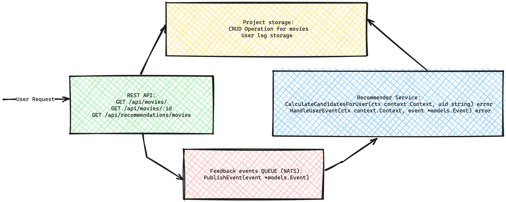

<p style="text-align: center;">Credit: <a href="https://pixabay.com/fr/users/652234-652234/">652234</a> on <a href="https://pixabay.com/">Pixabay</a></p>

---
### Introduction

Recommender systems are widely used these days in e-commerce, for the purpose of personalized
recommendation. Based on each user’s profile, previous purchase history, and online behavior, they
suggest products which they are likely to prefer. For example, Amazon.com is using recommender
systems for books. When a user logs-in to the system, it suggests books similar to previously bought
ones by the user.

### Project overview

Goal of this post is explain how to develop movie recommendation system with multi-armed bandit algorithm using
Go programming language. We will use PostgreSQL for storing move data and using interacitons. For real-time 
async data processing we will use NATS. Movie dataset is top [10k movies from IMDB](https://www.kaggle.com/datasets/umangdobariya1436/top-rated-movies-dataset)

### Project architecture

Top level architecture with base interface method describe below:


<p style="text-align: center;">Diagram service: <a href="https://excalidraw.com/">Excalidraw</a></p>

The project consists of 4 main blocks:
#### 1. REST API
Main user facing interface. API has method fo retrieve list of movie, single move and 
list of recommendation. In order to identify user for personal recommendation, we wil use 
uxid header. REST API has realized using [chi](https://github.com/go-chi/chi) router, [zap](https://github.com/uber-go/zap) 
for logging.
#### 2. Project repository 
Storage for movie data, user-movie interaction logs and recommendation entities. In project 
we use PostgreSQL.
#### 3. Feedback events QUEUE
Queue needs for real-time event handling, personalisation recommendation calculation. 
We will use NATS JSON messages for event handling.
#### 4. Recommender service
Recommender service is a core of personalisation recommendation of project. Recommender interface has two methods: 
```go
type Recommender interface {
    CalculateCandidatesForUser(ctx context.Context, uid string) error
    HandleUserEvent(ctx context.Context, event *models.Event) error
}
```
HandleUserEvent - handle user interaction with movie and update user interactions log.
CalculateCandidatesForUser - provides recommendations for user

All source code available by [link](https://github.com/KushnerykPavel/recommendation-system).
